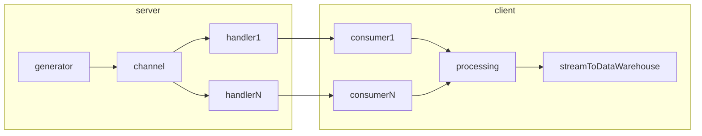

# Data Streaming Api

Some Streaming data sources are available on the internet, ex: [twitter stream](https://developer.twitter.com/en/docs/tutorials/consuming-streaming-data).

There are not many sources and when they are available, they are limited and strict quotas applies. Hence limiting streaming dataflow and the amount of data you can receive in a time window.

In order to load test Data ingestion pipelines, we need to be able to generate this type of service ourself.

This project aims to implement this feature.

## service detail

Code is commented but here is the big picture of what this server should enable us to do: 

the client part should be a scalable data pipeline built with dataflow spark or kubernetes